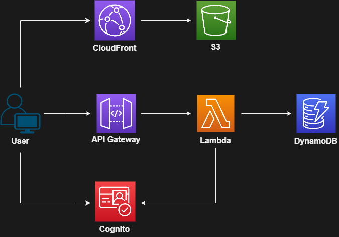

# TheGlobalGood

TheGlobalGood is a sustainable, ethical and fair-trade e-commerce project.

## Frontend Technologies

The frontend is built with React 18, hosted on AWS S3 and distributed via AWS CloudFront. User authentication is handled by AWS Cognito.

-   TypeScript
-   React 18
-   Vite
-   React Router
-   TailwindCSS
-   HeadlessUI

## Backend (Serverless) Technologies

The backend is built with AWS Serverless technologies. The backend is hosted on AWS Lambda and the database is AWS DynamoDB. User authentication is handled by AWS Cognito.

-   TypeScript
-   AWS API Gateway
-   AWS Lambda (Node.js)
-   AWS DynamoDB
-   AWS Cognito (User Authentication)

## AWS Infrastructure

</img>
